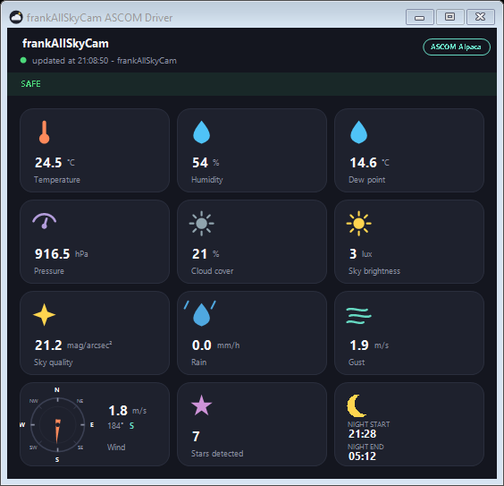

# frankAllSkyCam ASCOM Driver

An [ASCOM Alpaca](https://ascom-standards.org/AlpacaDeveloper/) driver that exposes the weather/sky data published by a **frankAllSkyCam** AllSky camera to any Alpaca-compatible astronomy imaging software (N.I.N.A., SharpCap, Sequence Generator Pro via the ASCOM Alpaca Chooser bridge, ...).

It polls a camera's `weather.json` endpoint and re-publishes it as two standard Alpaca devices — `ObservingConditions` and `SafetyMonitor` — plus a small Windows tray application for status and configuration.



## Features

- **ObservingConditions device**: cloud cover, dew point, humidity, pressure, rain rate, sky brightness, sky quality, temperature, wind direction/speed/gust, plus star count via an Alpaca custom action.
- **SafetyMonitor device**: reports `IsSafe` based on independently configurable per-quantity thresholds (cloud cover, rain, wind gust/speed, sky brightness, humidity, dew point, sky quality, minimum temperature, minimum pressure, minimum star count, and "outside the astronomical night window").
- **Tray application**: a dark-themed status window showing every live reading with hand-drawn icons (including a cloud-cover icon that switches between overcast / partly cloudy / clear-day / clear-night to match the actual reading), plus dialogs to edit notification and safety-threshold settings without touching JSON by hand.
- **Telegram notifications**: an alert is sent when conditions transition safe → unsafe (and back) — optionally restricted to the astronomical night window — and texting `now` or `status` to the bot replies with a screenshot of the live status window plus (optionally) a copy of the camera's live image.
- **Windows installer**: a per-user Inno Setup installer (no admin rights required) with optional "launch at Windows startup" and "auto-restart if unresponsive" (watchdog) tasks, built for machines without .NET installed (self-contained).

## Requirements

- Windows 10/11 (WinForms tray UI + Kestrel host)
- An AllSky camera publishing a `weather.json` endpoint in the shape this driver expects (see `WeatherJsonDto`)
- Any ASCOM Alpaca-aware client: N.I.N.A., SharpCap, or Sequence Generator Pro via the ASCOM Platform's Alpaca Chooser bridge (SGP has no native Alpaca support)

## Installing

Download the latest installer from the [Releases](../../releases) page and run it — it installs per-user under `%LOCALAPPDATA%`, no admin prompt. On first launch, edit `appsettings.json` in the install folder (or use the tray menu's settings dialogs) to point `AllSkyWeather:SourceUrl` at your camera's JSON endpoint.

In your imaging software, add an Alpaca device pointed at `127.0.0.1:51111` (default port, configurable).

## Configuration

Settings live in `appsettings.json` next to the executable:

| Section | Purpose |
|---|---|
| `AllSkyWeather` | Source JSON URL, poll interval, HTTP port, device name |
| `SafetyMonitor` | Per-quantity `{ Enabled, Threshold }` rules, max data age, night-window check — also editable from the tray's "Safety threshold settings" dialog |
| `Notifications` | Telegram bot token, chat ID, AllSkyCam image URL, enabled flag, "only notify at night" flag — also editable from "Notification settings" |

Threshold and notification settings are picked up live (no restart needed) after saving from the tray dialogs.

### Telegram bot setup

1. Create a bot with [@BotFather](https://t.me/BotFather) and grab its token.
2. Message the bot once, then fetch `https://api.telegram.org/bot<token>/getUpdates` to find your chat ID.
3. Enter both in the tray's "Notification settings" dialog and send a test message.
4. Text `now` or `status` to the bot at any time for a live status screenshot.

If you run the driver on more than one machine, use a **separate bot per machine** — Telegram allows only one active listener per bot token, so sharing one across machines means only one of them will ever receive the `now` command.

Check "Only send notifications at night" in the same dialog to suppress safe/unsafe alerts during the day (based on the camera's own sunrise/sunset times) — daytime cloud cover or wind changes stop triggering a message, while `now`/`status` still replies at any time.

### Watchdog (auto-restart if unresponsive)

Enabling "Automatically restart frankAllSkyCam ASCOM Driver if it becomes unresponsive" during install registers a per-user Scheduled Task (no admin rights needed) that runs `Watchdog.ps1` every 5 minutes. It pings the app's own local Alpaca endpoint (`http://127.0.0.1:<port>/management/apiversions`); if that doesn't respond, it kills and relaunches `AlpacaAllSkyWeather.exe`, and logs the event to `watchdog.log` next to the executable.

It does **not** distinguish a crash/hang from you deliberately choosing "Exit" from the tray menu — either way, the app comes back on the next check. To leave it stopped on purpose (e.g. during a manual upgrade), disable the Scheduled Task first (Task Scheduler → "frankAllSkyCam ASCOM Driver Watchdog"), or uncheck the task when reinstalling.

## Building from source

```bash
dotnet build
dotnet test
```

To produce a self-contained Windows build and installer:

```bash
dotnet publish src/AlpacaAllSkyWeather/AlpacaAllSkyWeather.csproj -c Release -r win-x64 --self-contained true -o publish/win-x64
```

Then compile `installer/AlpacaAllSkyWeather.iss` with the [Inno Setup Compiler](https://jrsoftware.org/isinfo.php) (`ISCC.exe`).

## Project layout

- `src/AlpacaAllSkyWeather/Alpaca/` — Alpaca device implementations and REST endpoints
- `src/AlpacaAllSkyWeather/Weather/` — weather polling, safety rules, Telegram integration
- `src/AlpacaAllSkyWeather/TrayHost/` — WinForms tray icon, status window, settings dialogs
- `installer/` — Inno Setup script
- `tests/` — xUnit test suite

## Trademark note

The status window shows an "ASCOM Alpaca" text badge, not the official ASCOM/Alpaca logo — the official marks are reserved for registered/certified products. This driver has passed ASCOM's ConformU conformance checks.
